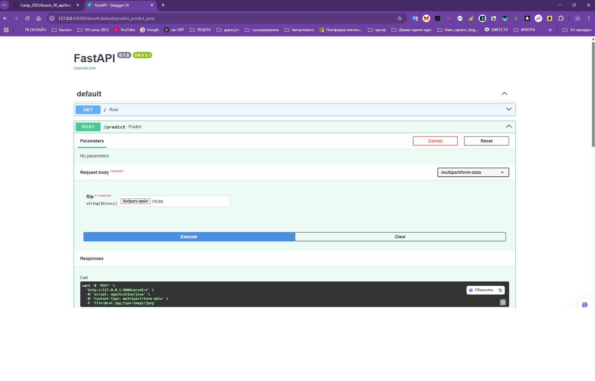
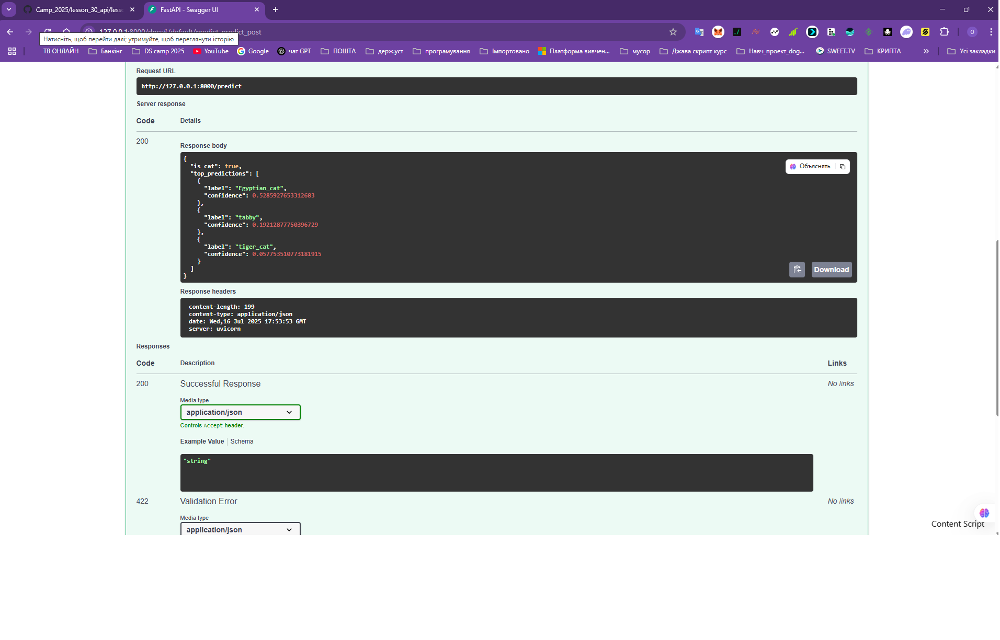

# 🐱 Cat Detector API

## 📌 Overview

Це простий проєкт комп'ютерного зору з використанням попередньо навченої моделі `MobileNetV2`, яка визначає, чи є на зображенні **кіт**.

Модель розгорнута як **REST API** з використанням **FastAPI**. Має зручну документацію Swagger, яку можна перевірити через браузер.

---

## 🚀 Deployment Info

- **API Framework**: FastAPI  
- **Model**: MobileNetV2 (ImageNet)
- **Serving**: Uvicorn
- **Inference**: Модель повертає топ-3 передбачення та визначає, чи зображення містить кота.

---

## ⚙️ Installation

> 🔹 Перед встановленням активуй віртуальне середовище (якщо ще не активоване).

```bash
git clone https://github.com/KuzmenkoO/hw_api_cv.git
cd hw_api_cv

# створення віртуального середовища
python -m venv venv
venv\Scripts\activate          # Windows
# або
source venv/bin/activate       # Linux/macOS

# встановлення залежностей
pip install -r requirements.txt
```

---

## 🧠 Modeling Info

- Використовується `MobileNetV2`, натренована на ImageNet (1000 класів).
- Для класифікації використовується функція `decode_predictions`.
- Кіт визначається за ключовими словами: `"Egyptian_cat"`, `"tabby"`, `"tiger_cat"`, `"Persian_cat"`, тощо.

---

## 🧪 Запуск сервера

```bash
uvicorn app.main:app --reload
```

Після запуску, відкрий у браузері:

📎 [http://127.0.0.1:8000/docs](http://127.0.0.1:8000/docs) — Swagger UI

---

## 🔌 Interface Description

### `GET /`

- **Опис**: Перевірка доступності API.
- **Відповідь**:
```json
{ "message": "Cat Detector API is running" }
```

---

### `POST /predict`

- **Опис**: Класифікація зображення. Повертає топ-3 передбачення і `is_cat: true/false`.

- **Вхід**: файл зображення (JPG/PNG)

- **Приклад відповіді**:
```json
{
  "is_cat": true,
  "top_predictions": [
    {
      "label": "Egyptian_cat",
      "confidence": 0.7412
    },
    {
      "label": "tabby",
      "confidence": 0.1810
    },
    {
      "label": "tiger_cat",
      "confidence": 0.0713
    }
  ]
}
```

---

## 📷 Example of API in Use
> Скріншот з інтерфейсу Swagger UI після запиту `POST /predict`.





---

## 📁 requirements.txt

```txt
fastapi
uvicorn
tensorflow
pillow
python-multipart
```
